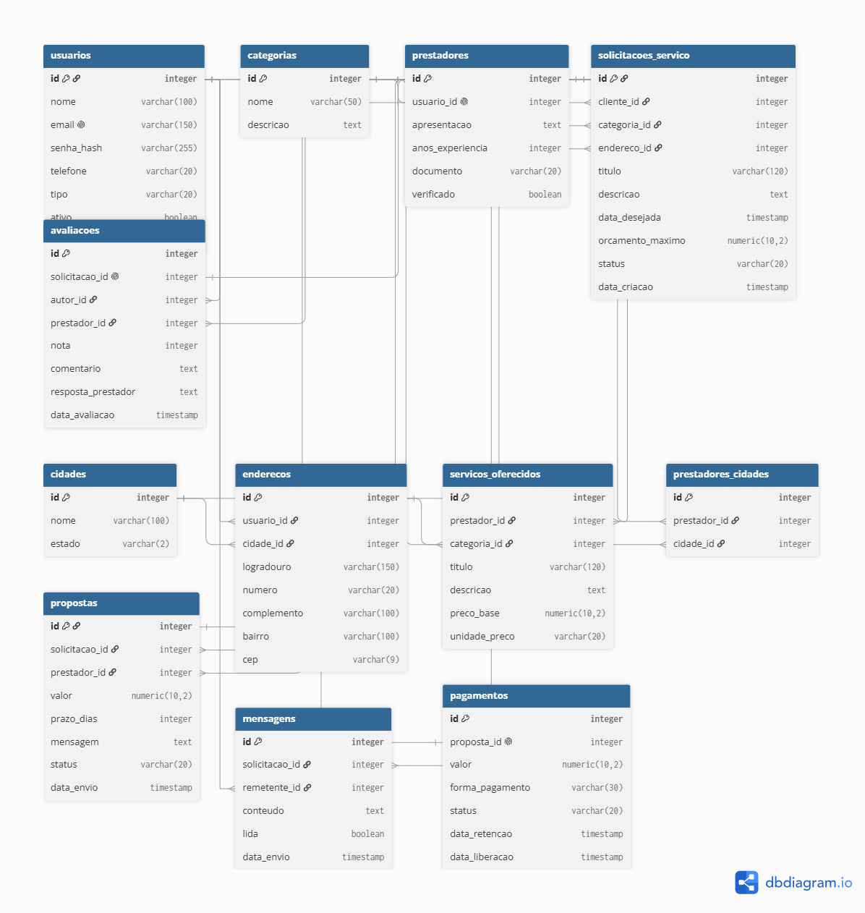

cat > README.md << 'EOF'
# Marketplace de Serviços Gerais

Plataforma web que conecta clientes a prestadores de serviços gerais (pedreiro, encanador, eletricista, diarista, pintor). O cliente publica o que precisa, os prestadores enviam propostas com valor e prazo, e o cliente escolhe uma. O pagamento fica retido até o cliente confirmar que o serviço foi feito.

Projeto Integrador desenvolvido para as disciplinas de Estrutura de Dados e Projetos.

## Tecnologias

- Next.js com TypeScript
- PostgreSQL (hospedado no Neon)
- Drizzle ORM

## Banco de dados

O banco tem 12 tabelas. A estrutura é definida em `src/db/schema.ts` e aplicada ao banco através das migrations em `drizzle/`.

| Tabela | Descrição |
|---|---|
| cidades | Cidades e estados atendidos |
| usuarios | Clientes e prestadores cadastrados |
| enderecos | Endereços dos usuários, ligados a uma cidade |
| categorias | Tipos de serviço disponíveis |
| prestadores | Perfil profissional de quem presta serviço |
| servicos_oferecidos | Serviços de cada prestador, com preço |
| prestadores_cidades | Cidades onde cada prestador atende |
| solicitacoes_servico | Pedidos publicados pelos clientes |
| propostas | Orçamentos enviados pelos prestadores |
| mensagens | Conversa entre cliente e prestador |
| pagamentos | Valor e situação do pagamento |
| avaliacoes | Nota e comentário após o serviço |

## Fluxo do sistema

1. O cliente publica uma solicitação, descrevendo o que precisa, com categoria, endereço e prazo desejado.
2. Prestadores da categoria enviam propostas com valor e prazo.
3. O cliente aceita uma proposta. As outras são recusadas e a solicitação passa para "em andamento".
4. O pagamento entra como "retido".
5. O serviço é executado. Cliente e prestador podem trocar mensagens durante o processo.
6. O cliente confirma a conclusão. A solicitação passa para "concluída" e o pagamento é liberado.
7. O cliente avalia o prestador. Cada solicitação só pode ser avaliada uma vez.

## Estrutura do projeto